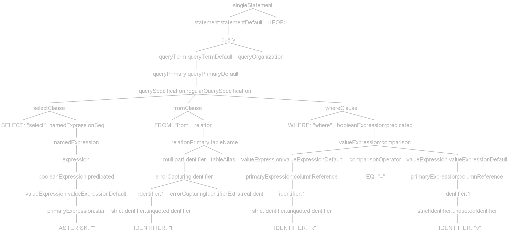
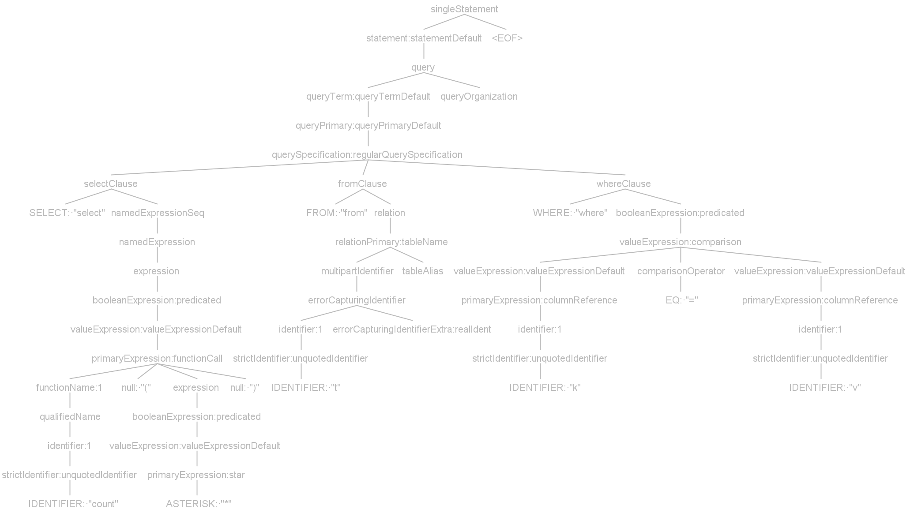

# MyPages

MyPages is a java based, open source pagination plugin for [MyBatis](https://github.com/mybatis/mybatis-3) that simplifies database paging queries. Many databases, one plugin.

## Installation

Please make sure the Java version is 1.8 or above.

```bash
$ git clone https://github.com/yihleego/mypages.git
$ cd mypages
$ mvn clean install
```

## Dependency

### Maven

```xml
<dependency>
    <groupId>io.leego</groupId>
    <artifactId>mypages</artifactId>
    <version>2.1.0</version>
</dependency>
```

### Gradle

```xml
implementation 'io.leego:mypages:2.1.0'
```

## Supported

|Database|
|:---|
| PostgreSQL|
| MySQL|
| Oracle|
| Microsoft SQL Server|
| SQLite|
| DB2|
| H2|
| MariaDB|
| HSQLDB|
| Apache Phoenix|
| Apache Derby|
| Apache Hive|
| Informix|

## ANTLR

**ANTLR** (ANother Tool for Language Recognition) is a powerful parser generator for reading, processing, executing, or translating structured text or binary files. It's widely used to build languages, tools, and frameworks. From a grammar, ANTLR generates a parser that can build and walk parse trees.

### Original SQL

```sql
select * from t where k = v
```



### Generated SQL

```sql
select count(*) from t where k = v
```



## Documentation

[Chinese Document 中文版](README.ZH_CN.md)

> * [User Guide (English)](mypages/README.md)
> * [用户指南 (中文版)](mypages/README.ZH_CN.md)
> * [mypages-spring-boot-starter (English)](mypages-spring-boot-starter/README.md)
> * [mypages-spring-boot-starter (中文版)](mypages-spring-boot-starter/README.ZH_CN.md)

## Contact

> * Bugs & Issues: [Click Here](https://github.com/yihleego/mypages/issues)

## License

MyPages is under the Apache 2.0 license. See the [LICENSE](LICENSE.txt) file for details.